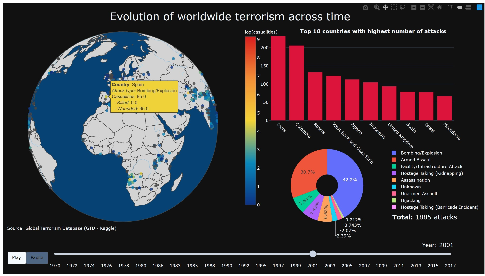

# CS-E4450 : Explorative-information-visualization

## Project 1: Global Terrorism Database analysis

### HOW TO
1. **Download the dataset:** download from
   [link](https://www.kaggle.com/START-UMD/gtd/data) to **/data**
* **Generate the visualization:** ``python3 fig.py``
* **See the visulization:** generate it or visit
  

### Git organization
* **/data:** Contain the raw dataset
* **/dev:** private development tests
* **/output:** containes a screenshot of the visualization as well as the html 
visualization.
* **/Report:** the report
* _fig.py:_ the code to generate the visualization

### About the dataset

### Source
* [kaggle dataset](https://www.kaggle.com/START-UMD/gtd/data)

### Content

**Geography:** Worldwide

**Time period:** 1970-2017, except 1993

**Unit of analysis:** Attack

**Variables:** >100 variables on location, tactics, perpetrators, targets, and outcomes

**Sources:** Unclassified media articles (Note: Please interpret changes over time with caution. Global patterns are driven by diverse trends in particular regions, and data collection is influenced by fluctuations in access to media coverage over both time and place.)

**Definition of terrorism:**

"The threatened or actual use of illegal force and violence by a non-state actor to attain a political, economic, religious, or social goal through fear, coercion, or intimidation.

### Relevant columns explanation
[Table generator](https://www.tablesgenerator.com/markdown_tables#)

| **Keep** | **Column name**                                     | **Explanation**                                                   |
|:--------:|-----------------------------------------------------|-------------------------------------------------------------------|
|     1    | ``iyear -> year``                                   | year in which the incident occurred.                              |
|     1    | ``imonth -> month``                                 | month in which the incident occurred                              |
|     0    | ``iday -> day``                                     | day of the month on which the incident occurred                   |
|     0    | ``country -> country_id``                           | country code                                                      |
|     1    | ``country_txt -> country``                          | country or location where the incident occurred                   |
|     0    | ``region -> region_id``                             | identifies the region code based on 12 regions                    |
|     0    | ``region_txt -> region``                            | region in which the incident occurred                             |
|     1    | ``city``                                            | Name of the city, village, or town in which the incident occurred |
|     1    | ``latitude -> lat``                                 | latitude of the city in which the event occurred                  |
|     1    | ``longitude -> long``                               | longitude of the city in which the event occurred                 |
|     1    | ``summary``                                         | A summary, when available, of then event                          |
|     1    | ``success``                                         | Success of a terrorist strike                                     |
|     0    | ``suicide``                                         | 1 = "Yes" The incident was a suicide attack. 0 = "No"             |
|     0    | ``attacktype<1-2-3> -> attack_type<1-2-3>_id``      | general method of attack                                          |
|     1    | ``attacktype<1-2-3>_txt -> attack_type<1-2-3>``     | general method of attack and broad class of tactics used          |
|     0    | ``targtype<1-2-3> -> target_type<1-2-3>_id``        | ?                                                                 |
|     1    | ``targtype<1-2-3>_txt -> targer_type<1-2-3>``       | general type of target/victim                                     |
|     0    | ``targsubtype<1-2-3> -> targ_subtype<1-2-3>_id``    | ?                                                                 |
|     0    | ``targsubtype<1-2-3>_txt -> target_subtype<1-2-3>`` | more specific target category                                     |
|     0    | ``natlty<1-2-3> -> natlty<1-2-3>_target_id``        | ?                                                                 |
|     1    | ``natlty<1-2-3>_txt-> natlty<1-2-3>_target``        | nationality of the target that was attacked                       |
|     1    | ``gname<1-2-3> -> group<1-2-3>``                    | name of the group that carried out the attack                     |
|     1    | ``motive``                                          | motive of the attack                                              |
|     0    | ``individual``                                      | ?                                                                 |
|     1    | ``nperps-> nattackers``                             | number of terrorists participating in the incident                |
|     0    | ``nperpcap``                                        | ?                                                                 |
|     1    | ``weaptype<1-2-3> -> weap_type<1-2-3>_id``          | Weapon type for the attack                                        |
|     1    | ``nkill``                                           | number of total confirmed fatalities for the incident             |

## Result

